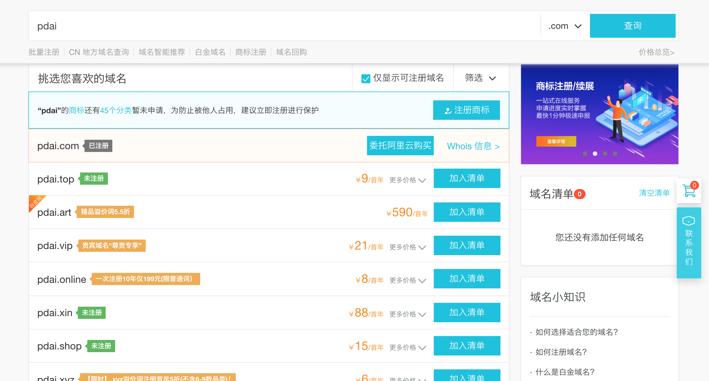
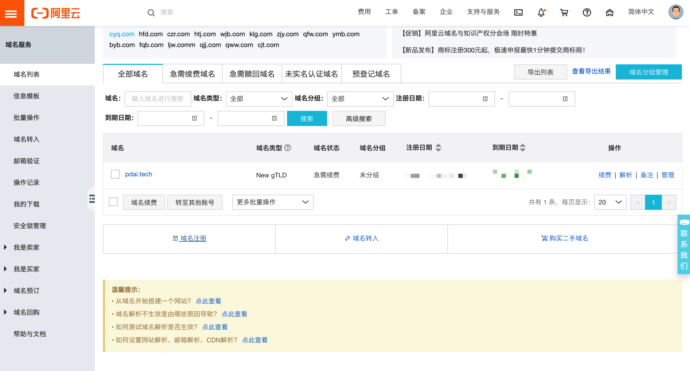
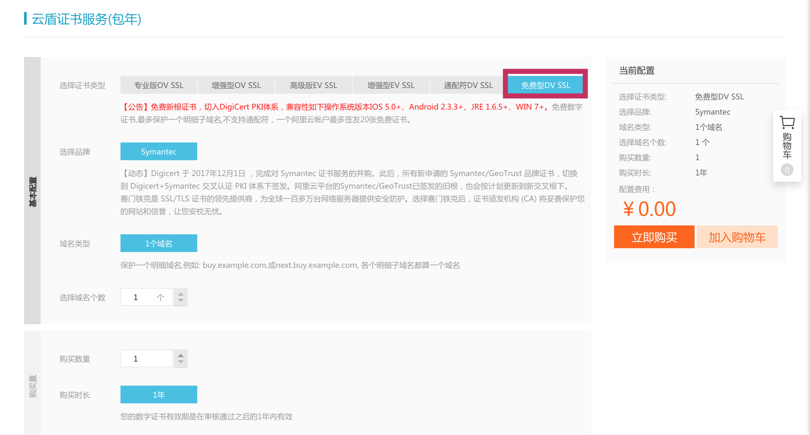
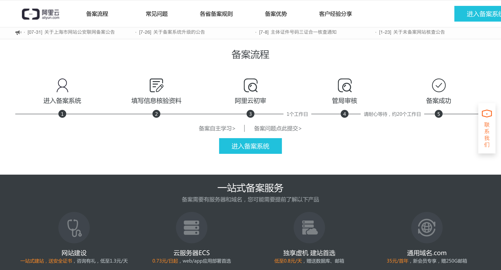

## 关于文档 - 文档的域名，HTTPS，备案

> 本文主要记录 本文档的域名，HTTPS，备案。 @pdai

文档的域名，HTTPS，备案 这三个步骤不能反，因为存在依赖关系。

### 申请域名

+ 申请：万网

+ 申请域名

### https

+ 阿里云上：SSL证书

+ 申请证书

+ 证书审核
> 30分钟之内就审核完成

+ 证书详情
> 这个详情页面在备案的时候需要拍照上传。

+ 证书下载

### 备案

> 80/443端口通过域名直接访问是需要备案的，在18年的时候我搭建过的个人网站是不要备案的。

+ 备案前访问 www.pdai.tech

+ 进入备案

> 期间需要手机通过阿里云人脸认证，并上传 身份证，域名和证书拍照等。

+ 备案审核

